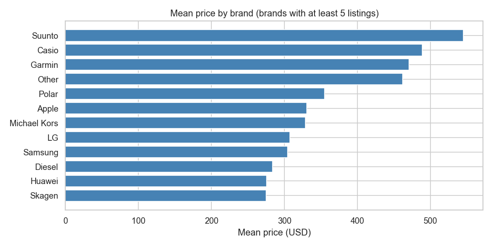
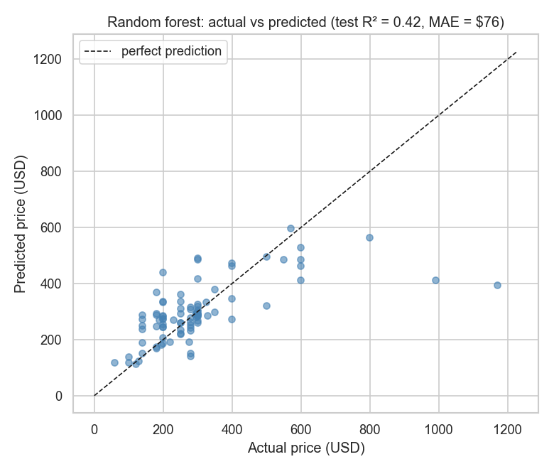
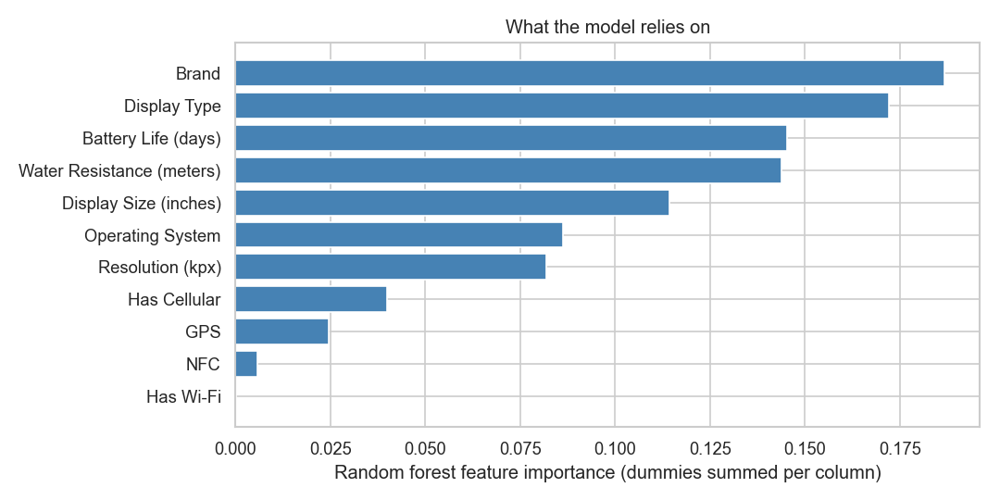

# Smartwatch price analysis

Can a smartwatch's spec sheet predict its price? An end-to-end analysis of ~380 smartwatch listings ([Kaggle dataset](https://www.kaggle.com/datasets/rkiattisak/smart-watch-prices)): cleaning messy text columns, EDA, and a comparison of regression models — with an honest look at two mistakes (data leakage and a broken feature encoding) that made early results look much better than they really were.

**Everything lives in [smartwatch-price-analysis.ipynb](smartwatch-price-analysis.ipynb).**

## Key findings

- **There is a clear brand premium.** Suunto, Casio and Garmin average \$450–550, while Amazfit, Xiaomi or Realme sit under \$200 with broadly similar specs. Brand and display type are the strongest predictors of price; resolution and connectivity add almost nothing.

  

- **Specs alone explain well under half of the price.** A random forest beats the naive "predict the mean" baseline (MAE \$76 vs \$121 on the test set) but explains only ~20–40% of the price variance. What's missing from the data — materials, brand positioning, release year — is what sets prices in the premium segment, which is exactly where the model under-predicts.

  

- **21% of the dataset was duplicated rows, and it mattered a lot.** With duplicates left in, the same watch lands in both train and test sets and the random forest looks almost twice as accurate (MAE \$41 vs \$76). Deduplication turned an impressive-looking R² ≈ 0.8 into a realistic ~0.4.

  

## Model comparison (5-fold cross-validation)

| Model | CV R² (mean ± std) | CV MAE |
|---|---|---|
| Baseline (predict the mean) | −0.02 ± 0.02 | \$134 |
| Linear regression | 0.04 ± 0.57 | \$115 |
| Ridge (alpha=10) | 0.30 ± 0.18 | \$104 |
| Decision tree (tuned) | 0.12 ± 0.15 | \$111 |
| **Random forest** | **0.20 ± 0.26** | **\$92** |

## Two lessons this project taught me

1. **Check for duplicate rows before splitting.** Exact duplicates leak between train and test and reward memorization. This single check changed the project's conclusions more than any modeling choice.
2. **Less encoding beats more encoding.** My first attempt one-hot encoded every column — including 137 unique model names — without `drop_first`, producing 248 features for ~260 training rows, a rank-deficient matrix, regression coefficients in the trillions and a test R² of −5×10²¹. The fix: drop ID-like columns, group rare categories into "Other", parse numeric columns into actual numbers instead of string buckets, and use `drop_first=True`.

## Running it

```bash
pip install -r requirements.txt
jupyter notebook smartwatch-price-analysis.ipynb
```

## Data

`Smart watch prices.csv` — [Smart watch prices](https://www.kaggle.com/datasets/rkiattisak/smart-watch-prices) on Kaggle. Prices are listing prices without dates or regions, which limits how far any model on this data can go.

---
*Developed in collaboration with Claude (Anthropic).*
